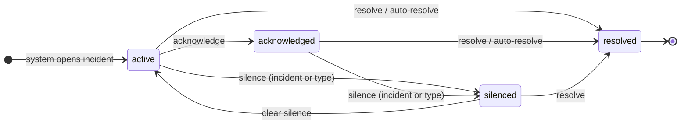

# Incident State Model

## State meanings

| State        | Meaning                                                          |
|--------------|------------------------------------------------------------------|
| active       | Incident is open and demands attention                           |
| acknowledged | Operator has seen it; still open, but no longer demanding notice |
| silenced     | Updates will not interrupt the operator                          |
| resolved     | Incident is no longer active                                     |

## Transitions

### Operator actions

| Action          | From                       | To           | Notes                                                         |
|-----------------|----------------------------|--------------|---------------------------------------------------------------|
| acknowledge     | active                     | acknowledged |                                                               |
| silence         | active, acknowledged       | silenced     | Scope `:incident` affects only this incident; scope `:type` also silences all matching open incidents and future ones of the same type |
| clear silence   | silenced                   | active       | Also clears the type-level silence when scope was `:type`     |
| resolve         | active, acknowledged, silenced | resolved |                                                               |

### System actions

| Trigger                    | From                 | To       | Example                                              |
|----------------------------|----------------------|----------|------------------------------------------------------|
| Detector opens incident    | —                    | active   | Four die events within 60 s                          |
| Detector updates evidence  | any                  | (same)   | Status unchanged; `last_seen` and evidence updated   |
| Auto-resolve signal seen   | active, acknowledged | resolved | SMART check passed; VM status=running                |
| Type silenced by operator  | active, acknowledged | silenced | `apply_type_silencing` runs on every ingested line   |
